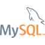
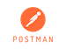

<h1>Welcome to my GitHub profile! 👋 </h1>

 

<h2>Education</h2>

  

My name is Gabriel, I am 28 years old, from Paris and I am a student in software engineering since October 2022 at:

<a href="https://adatechschool.fr/" target="_blank">
 

At Ada, I am<b> autonomously </b>learning all the programming fundamentals necessary to become a software engineer: programming languages and paradigms, networks and systems, processus, database creation and handling, Q&A and software architecture.

 
  
<h2>GOAL</h2>

Developping a strong interest for data processing, servers' administration and communication and the building of APIs and their routes, my main goal is to find a 12 months apprenticeship as a <strong>back-end software engineer</strong>, starting between June the 12th and July the 7th 2023. I am very curious about back-end engineering and can't wait to learn more about it in depth so I can achieve my Goal to become senior back-end engineer in the years to come. 

This apprenticeship would work on the basis of Monday to Thursday at work and Fridays at school.

 

<h2>Programming Languages and Tools</h2>

<h3>Programming Languages</h3>  
<table>
  <tbody>
    <tr>
      <td>
        
      </td>
      <td>
        
      </td>
      <td>
        
      </td>
      <td>
        
      </td>
      <td>
        
      </td>
      <td>
        
      </td>
      <td>
        
      </td>
    </tr>
  </tbody>
</table>

<h3>Frameworks</h3>
<table>
  <tbody>
    <tr>
      <td>
        
      </td>
      <td>
        
      </td>
      <td>
        
      </td>
      <td>
        
      </td>
    </tr>
  </tbody>
</table>

<h3>Tools</h3>
<table>
  <tbody>
    <tr>
      <td>
        
      </td>
      <td>
        
      </td>
      <td>
        
      </td>
      <td>
        
      </td>
      <td>
        
      </td>
      <td>
        
      </td>
      <td>
        
      </td>
    </tr>
  </tbody>
</table>

 

<h2>GitHub Stats</h2>

 
  
  

<h2>Projects</h2>

<h3>Personal Projects</h3>

<a href="https://github.com/Gabrielparizet/music-recognition-project" alt="Link to sound data repository">Sound Data</a>

Sound data is personal project I started recently and on which I am currently working on my free time.
The idea is to create a web application through which a user would be able to upload an audio file in order to get musical informations about it such as: the tempo (bpm), the length in minutes of the file and a graphical representation of the sound.

Currently working on an Minimum Viable Product, my goal for the V2 of <strong>Sound Data</strong> is to add the possibility to create an account in order to save the infos of a user's previously analyzed files, so they won't have to upload their files again.

<ul>
  <li>The back-end (ongoing) is done in Python with the use of Flask for the building of the API's routes.</li>
  <li>
    The audio-files are processed through a python package named <strong>Librosa</strong> which is specifically designed for music and audio analysis.       </li>
  <li>The front-end (ongoing) is created with the use of React.js and Tailwind.css. </li>
  <li>In the V2, I am planning to add a MySQL relational database to handle user's account data and the saving of files' slugs.</li>
</ul>

 

<h3>School Group Projects</h3>

 At Ada Tech School, we have two weeks imposed school group projects every month through which we have to learn new technologies and notions by building the projects's goal application.

 By working in an imposed group, we also work on our soft-skills, learning to communicate and to work in a team on the development of a program while using <strong>agile software development methods</strong>.

 

<a href="https://www.lexaloffle.com/bbs/?tid=50034&fbclid=IwAR0YV5Gn4N2OThKEuXc3lggdP-s6wqb0by1udEgkPSCwvddG6oZCzZeu6D0" alt="Vortex Blackhole">Vortex Blackhole</a>
<ul>
  <li>
    Vortex Blackhole is a space shooter game I developed with two classmates last October on the <strong>Pico-8 Fantasy Console </strong>.
  </li>
  <li> Essentially produced in pair-programming, this two weeks project allowed us to understand the role of functions and variables while discovering <strong>Lua</strong>, a lightweight, high-level, multi-paradigm programming language.</li>
</ul>

 

<a href="https://github.com/Gabrielparizet/diario_web_extension_project" alt="Diaro Chrome Web Extension">Diario</a>
<ul>
  <li>
    Diario is a Chrome Web Extension project developed in a group of three using Chrome Extension Manifest V3.
  </li>
  <li>
    Diario changes the content of your new Google Chrome tabs and provides such features as:
    <ul>
      <li>
        The display of the current weather based on the user's geolocation and time using Chrome's geolocation API and the open-meteo API for fetching weather's data. 
      </li>
      <li>
        Writing a ToDo List using Chrome's local-storage API.
      </li>
      <li>
        A carousel developed with <strong>Bootstrap.css</strong> displaying today's news fetched from the newsapi's API.
      </li>
      <li>
        The display of you chrome bookmarks in a tree-like layout using chrome.bookmarks API.
      </li>
    </ul>
  </li>
  <li>
    Diario also takes into account the user's time when he connects to the extension and adapts its theme accordingly.
  </li>
  <li>
    Diario's program is fully written in <strong>JavaScript</strong> and <strong>HTML/CSS</strong>, it allowed us to learn how to use the Document Object Model (DOM) programming interface.
  <li>
    The CSS grid was designed with the help of <strong>Bootstrap.css</strong> and is hence fully responsive.
  </li>
</ul>

      

